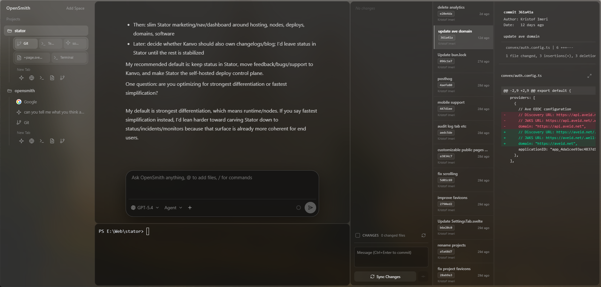

#  Argent

A browser for building things.

Argent is a desktop workspace that brings your AI chat, code editor, terminal, browser, and Git tools together in one window, organized as tabs, composable as splits.



## Philosophy

Argent is designed to be flexible.

It started from a project-management-minded workflow, but it is not meant to force one rigid way of working. You can use it as a structured multi-surface workspace, or just use the pieces you care about.

- use it as an organized shell for multiple terminal-driven agent sessions
- use it as a regular code editor for local files
- use it as a browser for docs, dashboards, and research
- use it as an AI-first workspace
- use it as a mixed environment where all of those stay visible and organized together

That flexibility is the point. Argent tries to give you a place to work that stays composable without being overly opinionated about your exact workflow.

## Status

Argent is currently pre-release software and the project is still moving quickly.

This repository is Windows-first today. The codebase includes cross-platform pieces such as Electron and `node-pty`, but macOS and Linux are not currently verified by the maintainer, so those platforms should be treated as experimental until tested by contributors.

## What It Does

- Project spaces backed by local folders
- AI chat tab with streaming responses, model selection, modes, slash commands, and file/image attachments
- Built-in editor with file tree, drag-and-drop file moves, save shortcuts, and tab opening
- Integrated terminal sessions powered by `node-pty` and `xterm.js`
- Built-in browser tab using Electron `webview`
- Git tab for status, staging, diffs, commit history, remotes, and sync actions
- Split-pane workspaces and persistent app state between launches

## Workflow Features

### Spaces And Tabs

Argent organizes work into spaces. A space can point at a project folder or act as a more general workspace, and each space can hold multiple tabs for AI, editing, terminal work, browsing, and Git.

Tabs are not just flat pages. You can drag a tab from the sidebar into the active workspace to split the view and build side-by-side or stacked layouts. That makes it easy to keep, for example, an editor beside a terminal or an AI conversation beside the file you are changing.

That same setup also works well for people running multiple agent or CLI sessions in parallel. For example, you can keep several terminal tabs active for different Claude Code or other tool runs while keeping them separated by space, tab, or split view instead of piling everything into one shell window.

### Command Palette

The app includes a command palette for quick navigation and creation. It can be opened with:

- `Ctrl+T`
- `Ctrl+K`
- `Ctrl+P`

On macOS, the same shortcuts map to `Cmd`.

The palette is designed for jumping between tabs and spaces or creating a new tab without mousing through the sidebar.

### Workspace Navigation Gestures

Argent supports horizontal workspace paging between tab groups and pages, including touchpad-friendly navigation.

- two-finger horizontal swipes can move between workspace pages
- the app supports "peek" style partial movement while swiping before the page commits
- browser tabs forward those swipe gestures back to the workspace so navigation still feels connected instead of trapping the gesture inside the webview

This makes moving across a larger workspace feel more like navigating a native desktop surface than clicking through isolated tabs.

### AI Tab

The AI tab is built for iterative coding work rather than one-shot prompts.

- streaming responses
- model picker with grouped variants
- mode switching
- slash command support
- file and image attachments
- conversation continuity per tab
- context usage display so you can see how much of the model window is being used

### Editor

The editor tab includes both file browsing and direct editing in the same surface.

- expandable file tree rooted at the current workspace folder
- open files in-place or in a new tab
- drag and drop files between folders
- context menu actions for cut, copy, paste, and delete
- `Ctrl+S` or `Cmd+S` to save
- font scaling shortcuts for quicker readability changes

### Terminal

Terminal tabs run real shell sessions through `node-pty`, not a fake console view. Sessions can persist with saved scrollback, resize with the workspace, and reopen with their previous history visible.

### Browser

The browser tab is useful for docs, testing, and quick research without leaving the app.

- address bar with URL-or-search behavior
- back, forward, and refresh controls
- shared persistent browser partition
- workspace-aware swipe integration

It can also simply be used as a normal browser tab when that is all you need. Argent does not require every tab to be part of an AI workflow.

### Git

The Git tab is meant to cover the common local source control loop without leaving Argent.

- repo detection and initialization
- changed-file list with stage and unstage controls
- diff viewing
- commit creation
- remote inspection and origin setup
- recent history browsing
- commit patch inspection
- sync-oriented workflow for pulling and pushing changes

## Current AI Support

This build currently supports OpenCode ACP in practice.

The codebase contains some compatibility scaffolding for other providers, but the shipped request path currently restricts assistant requests to the built-in `opencode-acp` provider. The README intentionally documents what works now rather than what may arrive later.

## Tech Stack

- Electron
- React 19
- TypeScript
- Vite
- Bun
- Tailwind CSS v4
- CodeMirror 6
- xterm.js
- `node-pty`

## Requirements

- [Bun](https://bun.sh/)
- [Git](https://git-scm.com/) for the Git tab and repository operations
- [OpenCode CLI](https://opencode.ai/) in `PATH` if you want AI chat to work

## Getting Started

```bash
bun install
```

### Run The Full Desktop App

```bash
bun run dev:desktop
```

This starts Vite and Electron together, which is the main development workflow.

### Run Renderer-Only

```bash
bun run dev
```

This is useful for frontend work, but Electron-only features such as the filesystem bridge, terminal, Git actions, and AI bridge will not behave like the packaged desktop app.

## Build And Launch

```bash
bun run build
bun run start:desktop
```

`bun run build` creates the renderer bundle in [`dist`](./dist). `bun run start:desktop` launches Electron against that built bundle.

At the moment, this repository does not include installer or distributable packaging scripts yet. It builds the app assets, but not a signed release package.

## Project Structure

```text
.
|- electron/        Electron main process, IPC, providers, terminal, and Git handlers
|- public/          Static assets
|- src/             React renderer and tab UI
|- dist/            Vite build output
```

## Notes On Platform Support

- Windows is the primary environment used during development.
- macOS support is unverified.
- Linux support is unverified.
- If you test and fix platform-specific issues, those contributions are especially valuable.

## Data And Configuration

Argent stores app state and provider data under Electron's user data directory in an `argent` subfolder. That includes:

- persisted workspace state
- provider configuration
- encrypted secrets when Electron `safeStorage` is available on the host system

## Contributing

Contributions are appreciated, especially as the project gets ready for release, but contribution does not guarantee review, feedback, or merge.

Please read [CONTRIBUTING.md](./CONTRIBUTING.md) before opening a pull request.

## Security

If you find a security issue, please read [SECURITY.md](./SECURITY.md) before reporting it.

## License

MIT
